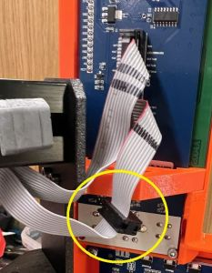

# Prusa LCD Reader

Connects to flat ribbon cable no. 1 of Prusa MK3S or similar, listens to LCD
communication, and sends the text to Home Assistant.

## Preparing the printer

Get a [10-pin IDC connector](https://www2.mouser.com/ProductDetail/Wurth-Elektronik/61201023021?qs=W%252B2sBeLta1Y7QgcPlTMBZQ%3D%3D)
and carefully attach it to flat ribbon cable no. 1, approximately where you want
the device to go. Make sure the orientation matches the other connectors.

[](images/ribbon-cable.jpg)

## Manufacturing notes

The board design doesn't rely on plated through-holes for the headers. (It still needs
some vias though.)

If you have the board manufactured profesionally, add some vias under pad 39 of
the ESP for better thermal performance.

### Components

- ESP32-WROOM-32
- voltage regulator 5V to 3.3V - SOT-233-3 footprint
- 6 NPN transistors (to protect GPIO from 5V signal) - SOT-23-3 footprint
- various resistors and capacitors (0805 footprint)
- 10-pin IDC connector header
- a reset button (optional)
- additional pin headers for the initial flashing (optional if you can bodge the
  connection without them)

## Sample ESPHome configuration
```yaml
external_components:
  - source: github://the-ress/prusa-lcd-reader@main
    components:
      - prusa_lcd

prusa_lcd:
  data_pins:
    - GPIO21
    - GPIO17
    - GPIO22
    - GPIO16
  enable_pin: GPIO19
  rs_pin: GPIO18
  text_sensors:
    - name: "Line 1"
    - name: "Line 2"
    - name: "Line 3"
    - name: "Line 4"
```

## Resources
- Decoder code adapted from https://github.com/fsalomon/HD44780-decoder/
- Special characters mapping: https://github.com/prusa3d/Prusa-Firmware/blob/MK3/Firmware/lcd.h#L199
- LCD board docs: https://reprap.org/wiki/RepRapDiscount_Smart_Controller
- Printer main board schematic: https://github.com/ultimachine/Einsy-Rambo/blob/1.1a/board/Project%20Outputs/Schematic%20Prints_Einsy%20Rambo_1.1a.PDF
